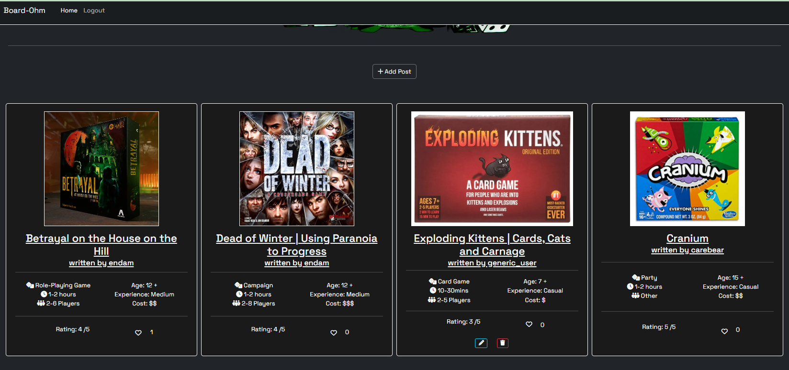
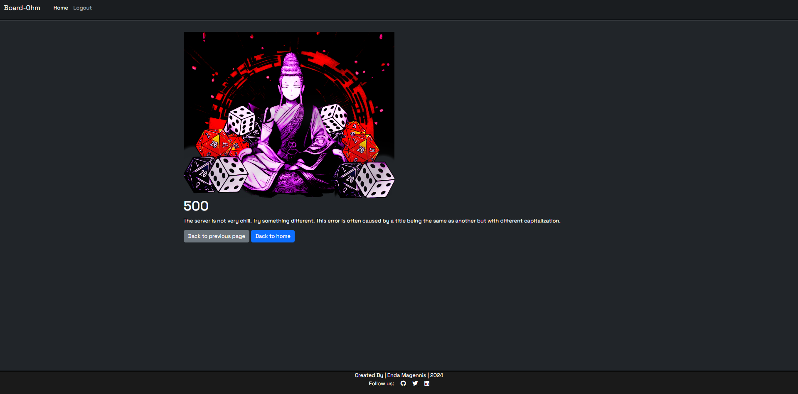

# Features

[Return to README](README.md)

## Minimum Viable Product Features (Implemented)

### Nav Bar

The navigation bar allows the user to navigate to the home page, login, register. The navbardynamically updates to show logout functionality to authenticated users. On smaller screens, the navbar collapses into a dropdown menu.

  - #### Navbar
  

  - #### Navbar dropdown
  

### Footer
The footer contains off-site navigation to my social media accounts.

  - #### Footer
  

### Home Page

The home page contains a feed of posts created by users.

  - #### Home page
  

### Authentication
Site users can use authentication features such as register, login and logout. Authenticated users get access to post creation, updating and deleting.

  - #### Registration
  

  - #### Login
  

  - #### Logout
  

### Create, Read, Update, Delete 
All site users can read posts. Authenticated users can create, update and delete their own posts, while admin can create posts, and update or delete all posts.

  - #### Create
  Posts are created using a form.
  

  Mobile view
  

  - #### Read 
  

  Mobile view
  

  - #### Update
  

  - #### Delete
  

  - #### Admin CRUD Functions
  

  - #### User CRUD Functions
  

## Nice To have/ Future Features

### Implemented

  #### Pagination

  When the home page has above 8 posts, a new page is created, and a navigation button is created to navigate to the new page. The new page, then, has navigation to return to the previous page.
   
   - Next
  

  - Previous
  

  #### Custom Error handling

   When common errors, 404 and 500, occur, the user is redirected to a custom page from where they can navigate home or to the previous page.

   404 error
    

  500 error
    

### Future Implementations
  
  #### Likes
  Likes were the top nice to have fearture, however implementation proved difficult and caused many errors. Given time contraints it has been deprecated. This feature will be iplemented in future

  #### Comments
  Another common fearture that will be added in the future is comments. Comments create more interactivity and generates engagement. 
  
  ### User profiles
  User profiles would give the user more control over their feed and also add to UX through customization.

  #### Search for posts
  Earlier iterations of the site nav bar contained a search bar. Again implementation proved tricky and time consuming, so MVP was prioritised. The site is still quite small and so navigation is not a massive hinderance. This feature will be added in future.

  #### Multiple images per post
  Given boardgames often have a lot of components and set up, this would be nice to show how large the game actually is and what play might look like. The card of each post could have a carosel to swipe through images

  #### Account verification/ retreival
  Allauth is substantial in the options available for authentication functionality. Implementing account validation through email would make the site less vulnerable to spam and trolling, though the reach of the site currently makes it a low priority. Additonaly, there is no sensitive information, such as payment credentials or other user account info available, making this implementation a lower priority.

  As I become more familiar and proficient with Django I hope that implementation of features becomes easier and more efficient.