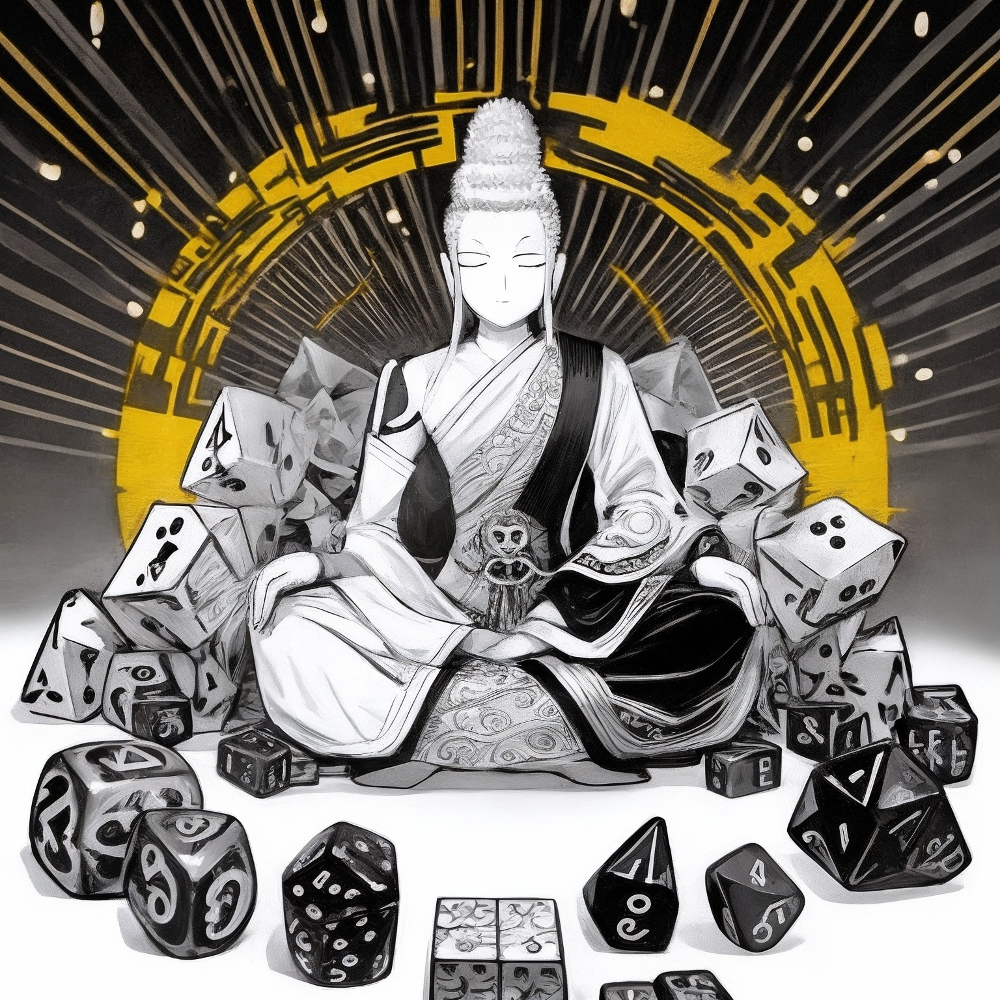
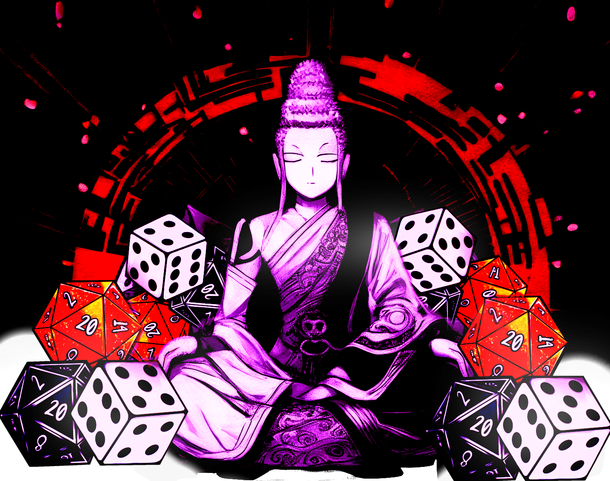
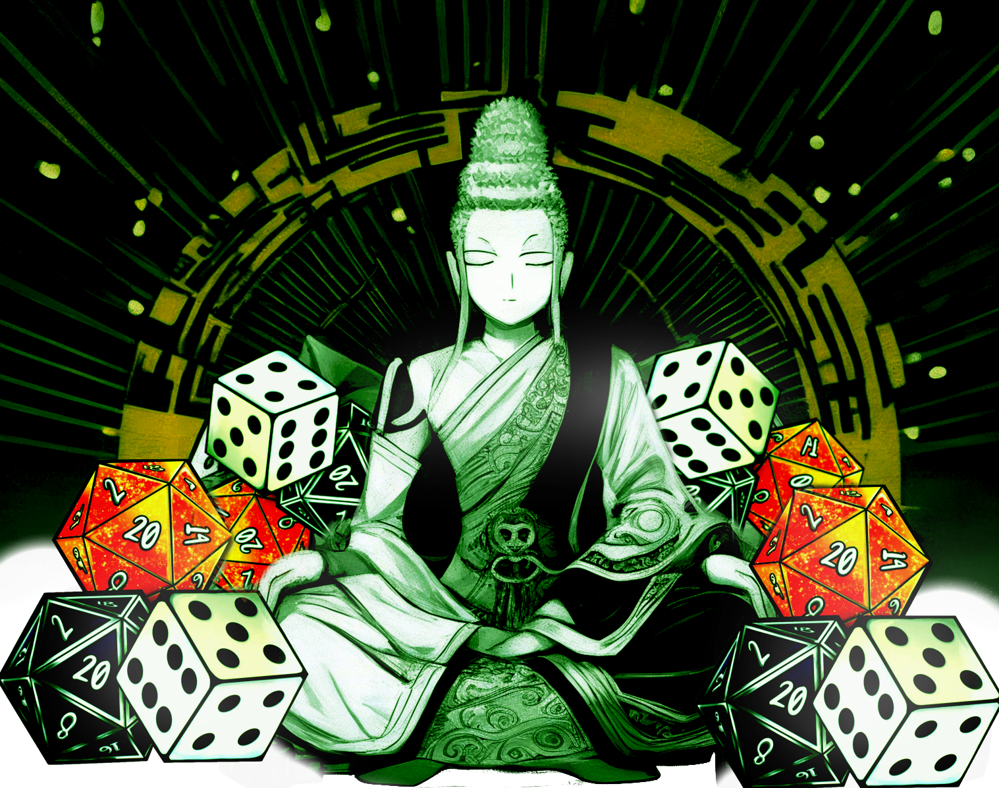

# [Board-Ohm](https://board-ohm-5d4ddb906f72.herokuapp.com/)

Board-Ohm is a user generated review site for board games. It can be quite a hefty cost to buy a new boardgame so knowing it's right for you is importamt.

## User Experience Design

git ### Strategy

This site is developed for boardgame enthusiasts to share their reviews and experiences of different boardgames. The primary goal of the app is to allow hobbyists to express their opinions and with social media-lite features.

## User Stories

| Issue ID                                                 | User Story                                                                                             |
| -------------------------------------------------------- | ------------------------------------------------------------------------------------------------------ |
| [#1](https://github.com/EndaMagennis/board-ohm/issues/1) | As a Site User I can view posts so that I can browse the site's content                                |
| [#2](https://github.com/EndaMagennis/board-ohm/issues/2) | As a Site User I can open posts so that I can access their full content                                |
| [#3](https://github.com/EndaMagennis/board-ohm/issues/3) | As a Site User I can Like posts so that I can interact with the site content in a meaningful way       |
| [#4](https://github.com/EndaMagennis/board-ohm/issues/4) | As a Site User I can create posts so that I can share my thoughts and opinions about the topic         |
| [#5](https://github.com/EndaMagennis/board-ohm/issues/5) | As a User I can create an account so that I can curate and create content on the site                  |
| [#6](https://github.com/EndaMagennis/board-ohm/issues/6) | As a Site Admin I can Create, Read, Update and Delete posts so that I can moderate the site content    |
| [#7](https://github.com/EndaMagennis/board-ohm/issues/7) | As a Site User I can Create, Read, Update and Delete my own posts so that I can control my own content |

## Technologies Used

- ### Languages:

  - [Python 3.12.0](https://www.python.org/downloads/release/python-3120/): used as the primary language used in backend functionality
  - [JavaScript](https://www.javascript.com/): used for interactive components
  - [HTML](https://www.w3schools.com/html/): used to create the skeleton of web pages
  - [CSS](https://www.w3schools.com/css/): used for styling the web pages

- ### Fameworks and Libraries:

  - [Django 4.2.8](https://docs.djangoproject.com/en/5.0/releases/4.2.8/): Python framework for full-stack development
  - [jQuery](https://jquery.com/): using AJAX requests to bridge frontend and backend
  - [Bootstrap](https://getbootstrap.com/): used to create consistent CSS styling

- ### Database:

  - [ElephantSQL](https://www.elephantsql.com/): a cloud based postgreSQL database

- ### Other Tools and Dependencies

  - [Git](https://git-scm.com/): version control for continous development
  - [Pip](https://pypi.org/project/pip/): python package mangager for installing dependencies
  - [Gunicorn](https://gunicorn.org/): Unix model which creates Python wsgi Http server
  - [Psychopg2](https://pypi.org/project/psycopg2/): PostgreSQL database adapter for the Python
  - [Django-allauth](https://docs.allauth.org/en/latest/release-notes/recent.html#id11): account creation library for django
  - [GitHub](https://github.com/): cloud repository for source code
  - [CodeAnywhere](https://app.codeanywhere.com/): Cloud IDE service used for the majority of development
  - [VSCode](https://code.visualstudio.com/): Local IDE used as backup
  - [Leonardo AI](https://leonardo.ai/): Used to generate the idea for the logo
  - [GIMP](https://www.gimp.org/): Used to color-correct, edit and personalise the logo

## Features

Please refer to the [FEATURES.md](FEATURES.md)

## Design

The app is mainly comprised of native bootstarap classes, utilising Bootstrap's dark-mode to create a muted and clean UI. The nature and ethos of the website is relaxed, casual boardgame reviews and so the pallette is dark, and subtle. Dark mode on devices can reduce blue light exposure and can, in some cases, [reduce eye strain](https://www.eyecarecenter.com/eye-care-resources/is-dark-mode-better-for-your-eyes) so it was the natural choice for a more relaxed website. Additionally, the name, board-ohm is a play on boredom and the zen phrase 'ohm', a chant often associated with buddhism. The banner image was generated with [Leonardo AI](https://leonardo.ai/) and then colour-corrected and edited using [GIMP](https://www.gimp.org/), and depcits a rendition of buddha surrounded by dice to marry the two concepts of boardgames and zen.

- ### Color Theme

  

- ### Imagery

  - #### AI generated original banner

    

  - #### First draft banner

    

  - #### Second draft banner

    

  - #### Third draft banner

    

  - #### Fourth draft banner

    

Ultimately, the first, second and fourth drafts were used in the project.

- ### Typography

  Within the primary font, Space Grotesk, the letters 'g' and 'y' contain sharply cut angles, while the captials 'D' and 'B' have hoverhang, which combine to create a font the is evocative of sanskrit; maitaining the theme of zen while remaining readble.

  - #### Space Grotesk

    

  The fallback font, Barlow condensed, is a stylised font which I feel has a clean and sharp typography which would fit nicely within the site.

  - #### Barlow Condensed

    

- ### Wireframes

  - #### Mobile View

    

  - #### Desktop View

    

  While the final design is different to the original concept, the overall aesthectic was maintained. The dropdown menu, like button, card style posts, and pagination persists, though the layout of each element varies from the original vision.

