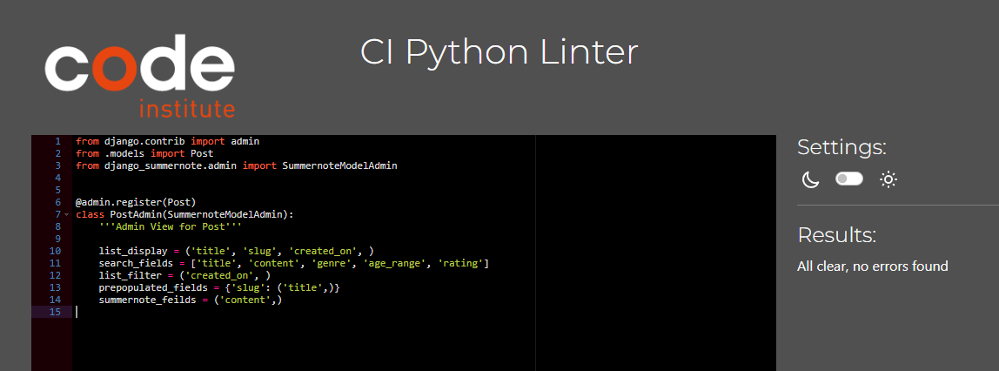

# Testing

[Back to README](README.md)

## Manual Testing

Testing was carried out on a near constant basis, with each new feature

### Account Creation

|#|User action|Expected result| Y/N|
|--|--|--|--|
|1|User clicks on 'Register' link|User is redirected to registration page|Y|
|2|User attempts to signup without filling in required fields|User is promted to fill in relevant required field|Y|
|3|User attempts to signup with existing username|User is prompted to change username|Y|
|4|User attempts to signup without email but all other fields filled correctly|User account is created and user is redirected to home page|Y|
|5|User attempts to signup with all fields filled correctly|User account is created and user is redirected to home page|Y|
|6|User clicks 'sign in' link|User is redirected to login page|Y|

### Account login
|#|User action|Expected result| Y/N|
|--|--|--|--|
|1|User clicks on 'Login' link|User is redirected to login page|Y|
|2|Registered user attempts to login with fields correctly filled in|User is logged in a redirected to home page|Y|
|3|Non-registered user attempts to login with fields filled in|User is told username or password are incorrect|Y|
|4|User clicks 'sign up' link|User is redirected to registration page|Y|

### Creating a post

|#|User action|Expected result| Y/N|
|--|--|--|--|
|1|Authenticated user clicks 'Add post' button|User is redirected to the post creation page|Y|
|2|User types unique title in title field|Field is populated wuth user input|Y|
|3|User types content in content field|Field is populated wuth user input|Y|
|4|User clicks 'Choose File' button in image field|User's device opens coiciding file explorer|Y|
|5|User clicks genre field dropdown|Field options are shown to user|Y|
|6|User clicks number of players field dropdown|Field options are shown to user|Y|
|7|User clicks age range field dropdown|Field options are shown to user|Y|
|8|User clicks play time field dropdown|Field options are shown to user|Y|
|9|User clicks experience field dropdown|Field options are shown to user|Y|
|10|User clicks price range field dropdown|Field options are shown to user|Y|
|11|User clicks rating field dropdown|Field options are shown to user|Y|
|12|User fills in required fields correctly and clicks 'post'|A new post is created and added to feed and user is redirected to home page|Y|
|13|User does not fill in required fields and clicks 'post'|User is focused to missing field and given an instruction to fill in field|Y|
|14|User attempts to post using a unique title and fills in all other fields correctly|User's post is created and added to feed and user is redirected to home page|Y|
|15|User attempts to post using a non-unique title and fills in all other fields correctly|User is prompted to give a unique title|Y|
|16|User presses 'Back' button at any point during post creation|User is redirected to previous page|Y|
|17|User selects a photo to upload and posts|Photo is uploaded along with post|Y|
|18|User does not select a photo to upload and posts|Post is made using a placeholder image|Y|

### Reading a Post
|#|User action|Expected result| Y/N|
|--|--|--|--|
|1|Any user clicks on a post|User is redirected to the post read page|Y|

### Updating a Post

|#|User action|Expected result| Y/N|
|--|--|--|--|
|1|Authenticated post author or admin clicks 'Pencil' button corresponding to a given post|User is redirected to the post's update page|Y|
|2|User lands on post's update page|All fields are prepopulated with existing data|Y|
|3|User updates title in title field|Field is populated with user input|Y|
|4|User updates content in content field|Field is populated wuth user input|Y|
|5|User clicks 'Choose File' button in image field|User's device opens coiciding file explorer|Y|
|6|User selects new genre field from dropdown|Field is changed to new selection|Y|
|7|User selects new number of players field dropdown|Field is changed to new selection|Y|
|8|User selects new age range field dropdown|Field is changed to new selection|Y|
|9|User selects new play time field dropdown|Field is changed to new selection|Y|
|10|User selects new experience field dropdown|Field is changed to new selection|Y|
|11|User selects new price range field dropdown|Field is changed to new selection|Y|
|12|User selects new rating field dropdown|Field is changed to new selection|Y|
|13|User fills in required fields correctly and clicks 'post'|The existing post is updated reflecting all changes and added to feed|Y|
|14|User does not fill in required fields and clicks 'post'|The existing post remains unaltered and user is redirected to home page|Y|
|15|User presses 'Back' button at any point during post update process|User is redirected to previous page and no changes are made to the post|Y|
|16|User selects a new photo to upload and posts|New photo is uploaded along with post|Y|
|17|User does not select a new photo to upload and posts|Post is made keeping original photo|Y|

### Deleting a Post
|#|User action|Expected result| Y/N|
|--|--|--|--|
|1|Authenticated post author or admin clicks 'Bin' button corresponding to a given post|User is redirected to the post's delete page|Y|
|2|User lands on post's delete page|User is given options to confirm deletion or to return to previous page|Y|
|3|User selects delete|Post is deleted and removed form feed|Y|
|4|User selects back|Post is redirected to previous page|Y|

### Pagination
|#|User action|Expected result| Y/N|
|--|--|--|--|
|1|User selects 'next' when pagination is available|User is directed to next page|Y|
|2|User selects 'prev' when pagination is available|User is directed to previous page|Y|

### Home Page
|#|Component|Expected result| Y/N|
|--|--|--|--|
|**Admin User**|
|1|Navbar|Shows 'Home' Link|Y|
|2|Navbar|Doesn't show 'Login' Link|Y|
|3|Navbar|Doesn't show 'Register' Link|Y|
|4|Navbar|Shows 'Logout' Link|Y|
|5|Main Page|Shows Welcome banner and image|Y|
|6|Main Page|Shows 'Add Post' button|Y|
|7|Main Page|Shows feed of created posts|Y|
|8|Main Page|Shows edit and delete options all posts|Y|
|9|Footer|Shows clickable offsite social links|Y| 
|10|Footer|Shows creadted by info|Y|
|**Authenticated User**|
|1|Navbar|Shows 'Home' Link|Y|
|2|Navbar|Doesn't show 'Login' Link|Y|
|3|Navbar|Doesn't show 'Register' Link|Y|
|4|Navbar|Shows 'Logout' Link|Y|
|5|Main Page|Shows Welcome banner and image|Y|
|6|Main Page|Shows 'Add Post' button|Y|
|7|Main Page|Shows feed of created posts|Y|
|8|Main Page|Shows edit and delete options only for posts created by user|Y|
|9|Footer|Shows clickable offsite social links|Y| 
|10|Footer|Shows creadted by info|Y|
|**Non-Authenticated User**| 
|1|Navbar|Shows 'Home' Link|Y|
|2|Navbar|Shows 'Login' Link|Y|
|3|Navbar|Shows 'Register' Link|Y|
|4|Navbar|Doesn't show 'Logout' Link|Y|
|5|Main Page|Shows Welcome banner and image|Y|
|6|Main Page|Doesn't show 'Add Post' button|Y|
|7|Main Page|Shows feed of created posts|Y|
|8|Main Page|Doesn't show edit or delete options for any post|Y|
|9|Footer|Shows clickable offsite social links|Y| 
|10|Footer|Shows creadted by info|Y|

## Bugs

While bugs and errors were frequent the most recurrent issue was in the auto formatting from Codeanywhere's IDE extension, Prettier. It would not recognise django tmeplating tags and would routinely break a single tag across multiple lines, causing server errors.

### Fixed

- Else tag casuing an error due to a corresponding if tag being broken onto many lines by the auto formatter

When navigating between models, views and templates, it was sometimes difficult to keep track of naming conventions used.

- Page could not be accessed due to url being called 'post_create' and not 'create_post'

- Styling for the dropdown menu caused an issue as it would disappear behind feed content. This was due to the container for the feed content being at a higher z-index than the dropdown. 

    - Issue

    

    - Fix

    

- Post creation was not creating a valid author id 

    - Issue 
    
    

    - Fix

    Updated the view to explictly add author for post

    

- Slugifyiing the post title caused an issue where two posts could have the same title with different capitalization, but the slug generated would be the same.

    - Issue

    

    - Fix

    The current fix is that the custom 500 error handler explains to the user the potential issue, though a more substantive fix would be to add a unique identifier to the end of each slug during post creation. This solution would be the approach further down the line.

    

### Existing Errors/ Deprecated Features

The ability to like a post was ulimately deprecated due to persistent errors occuring. It has been added to future features on the [FEATURES](FEATURES.md) page.

## Validation

### HTML

#### Home Page

#### Post Create

#### Post Read

#### Post Update

#### Post Delete

#### Login

#### Logout

#### Register

Errors raised by inactive AllAuth helpers

#### 404 Error

#### 500 Error

### CSS

### Accessiblity and performance

#### Home

### Create

Lighthouse cannot generate an accurate report due to not having an account.

### Read

### Update

Lighthouse cannot generate am accurate report due to not having an account.

### Delete

Lighthouse cannot generate an accurate report due to not having an account.

### Login

### Register

### Logout

Lighthouse cannot generate an accurate report due to not having an account.

## Pep 8 validation

#### Project

board_ohm/ views.py
    

board_ohm/ urls.py

#### App

feed/ admin.py

feed/ forms.py

feed/ models.py

feed/ urls.py

feed/ views.py

## Javascript

JavaScript was to be used for the likes functionality but as it was deprecated, custom Javascript was not used in this project. Again, future implementation.